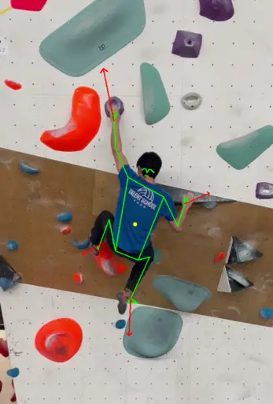

# climb-pose-estimation
This project aims to develop a pose estimator in Python using the MediaPipe library. The goal is to analyze climbing videos and provide insights such as determining success or failure in climbing routes, identifying the center of gravity of the climber, and assessing limb tension.

## Features
- Pose Estimation: Show the pose landmarks of the climber
- Center of Gravity: Identify the center of gravity of the climber by analyzing pose landmarks.
- Limb Tension Analysis: Evaluate the tension exerted by each limb during the climb to identify areas of weakness.

## How to use:
- Download all the libraries from *requirements.txt*.
- Run the program.
- Press 'space' to pause/unpause. 
- Press 'q' to close the window.

## To-Do List
- Implement success/failure detection logic.
- Add center of gravity calculation algorithms.
- Integrate limb tension analysis functions.
- Implement climbing detection techniques.
- Explore thresholding methods like Otsu's method for image enhancement.
- Add an argument parser for customization of visualization options.
- Climbing Detection: Detect climbing activity using various techniques such as pose dynamics analysis and hold detection.

## Contribution
Contributions are welcome! Feel free to contribute by implementing new features, improvements, or bug fixes . Please open an issue or pull request on GitHub.
